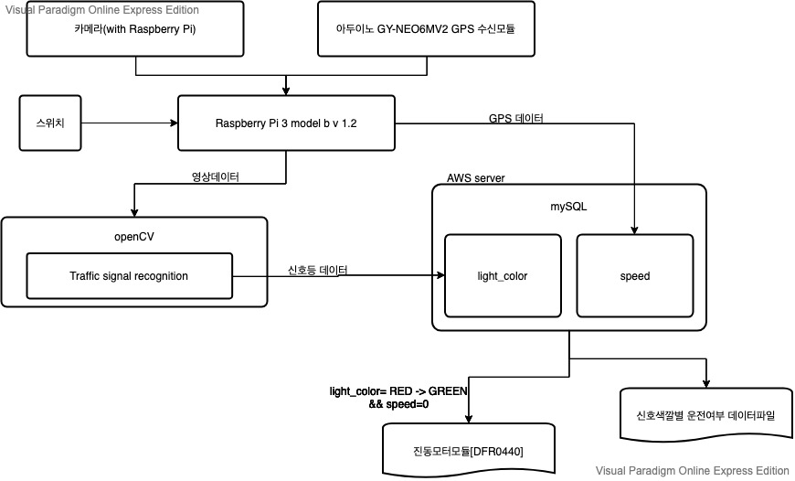
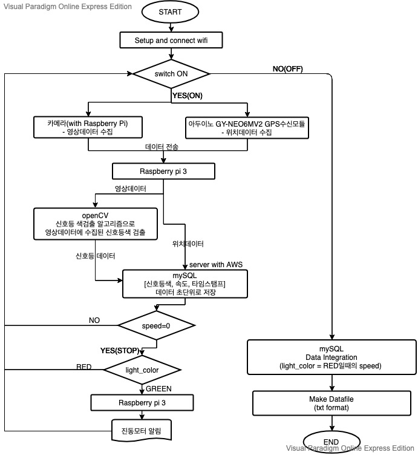

# Capstone_Team9 (윤기영/조영운/)
Traffic Light Alarm

1. 직관적인 타이틀

    신호대기시 원활한 교통흐름을 위한 초록불 알림 시스템
  
2. 무엇을 만드는가, 왜 만드는가 한문장

    교통의 원활한 흐름을 위해 신호대기 후 출발하는 과정에서 나오는 지연을 단축하기 위해서 신호등이 초록색으로 전환시 이를 운전자에게
    알려줄 수 있는 시스템을 만들고자 합니다
  
3. 시스템 구성도

    시스템 전체적인 구상도는 다음과 같습니다.
    

    
    

    
    시스템의 경우 일단은 빨간불에서 초록불로의 변화만 인식하여 알림을 주는 방식으로 구현하고 좌회전의 경우 현재 구현하고자 하는 시스템이 구현되면
    추가적으로 구현할 예정입니다.
    
  
4. 데이타 흐름도

   
    
    
    
    
    GPS 모듈인 NEO 6M 으로부터 km/h 단위로 된 속도값과 시간값을 데이터로 받고 카메라 모듈을 통해서는 
    운행중 촬영되는 영상을 데이터로 받습니다. 영상 데이터의 경우에는 opencv를 이용해서신호등 색을 판별 한 이후
    RED, YELLOW, GREEN 중에서 세가지 색 중에서 어느 색에 해당하는 지를 데이터로 저장할것입니다.
    
    결과적으로 mySQL에 저장할 값은 속도/신호등색(RED,YELLOW,GREEN)/시간(Hour:Minute:Second)입니다.
    이를 저장하기 위해 decimal(4,1) 타입의 speed 변수/ char(1) 타입의 light_type 변수/ TIMESTAMP  형식으로
    table을 작성할 계획입니다.
    
    
    
    
    
    속도의 경우에는 최대 3자리를 초과할 수 없고 정지와 이동을 파악하는것이 주목적이기 때문에 소수점 1자리 까지만
    저장할 수 있도록 decimal (4,1)의 형태로 저장하는 것이 적합하다고 판단했습니다.신호등 색의 경우에는 3가지만
    존재하고 간단하게 표현하기 위해서 각 경우의 앞 글자만 따서 R,Y,G 만 따서 char(1)의 형태로 저장하는 것이 적합하다고 판단했습니다.
    
    이렇게 mySQL에 table의 형식으로 저장하고 추가적으로 수집한 데이터를 이용해서 운전자에게 신호를 어기고 빨간불에
    운행을 한 시간을 정리할 계획입니다. 이를 위해서 한차례 운행이 종료되면 수집한 데이터 중에서 light_type이 R에 해당되지만
    speed가 일정 정수를 초과하는 TIMESTAMP 구간을 합쳐서 한번의 운행동안 총 얼마만큼의 시간동안 신호를 어겼는지를 txt파일 형태로
    출력할 것입니다.
    
    자동차 내부에서 사용해야 하는 장비이기 때문에 wi fi 는 이동형 무선 공유기인 egg를 이용하기로 했습니다.
    
